# User Flows: Scripture Journal (Phase 1)

**Source**: [docs/requirements/scripture-journal-requirements.md](../requirements/scripture-journal-requirements.md)
**Created**: 2026-04-21

---

## Flow 1: Login → Dashboard

**Actor**: Reader
**Goal**: Authenticate and reach the home screen
**Precondition**: User has an account (admin-created)

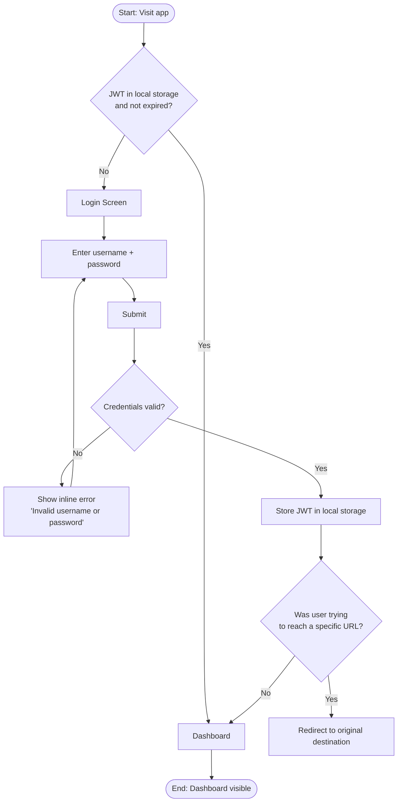

**Key decision points**:
- Existing valid JWT: skip login entirely
- Invalid credentials: stay on login, inline error, no redirect
- Deep link: return user to original destination after login

**Screens involved**: Login Screen, Dashboard

---

## Flow 2: Browse Scripture → Read Chapter → Annotate

**Actor**: Reader
**Goal**: Read a scripture chapter and attach notes to specific verses
**Precondition**: Authenticated

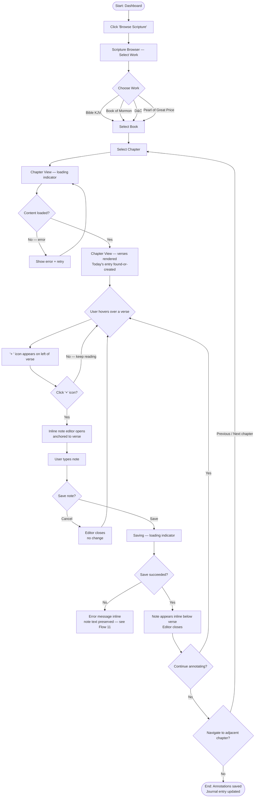

**Key decision points**:
- Find-or-create entry: transparent to user, happens server-side on first save
- Hover → "+" visible: only the hovered verse shows its "+" icon
- Multiple notes per verse: each save appends a new annotation (append-only)

**Screens involved**: Dashboard, Scripture Browser, Chapter View

---

## Flow 3: Import Article → Read → Annotate

**Actor**: Reader
**Goal**: Import a churchofjesuschrist.org article, read it, and attach paragraph-level notes
**Precondition**: Authenticated

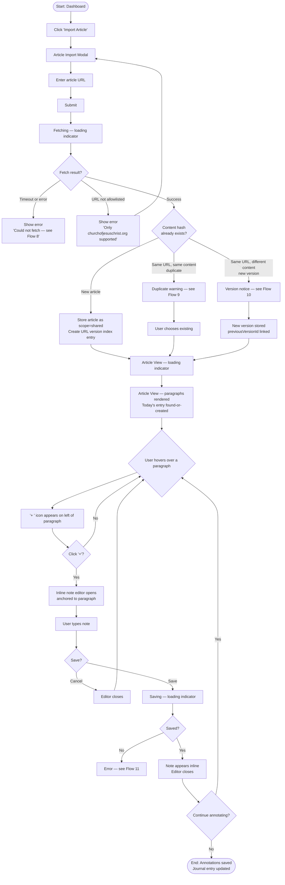

**Key decision points**:
- URL allowlist check happens server-side before fetch attempt
- Duplicate / version detection happens after successful fetch and hash comparison
- Article scope determined by source domain at import time (Phase 1: always shared)

**Screens involved**: Dashboard, Article Import Modal, Article View

---

## Flow 4: Dashboard → View Past Journal Entry

**Actor**: Reader
**Goal**: Revisit a previous study session and read its annotations in context
**Precondition**: Authenticated; at least one past journal entry exists

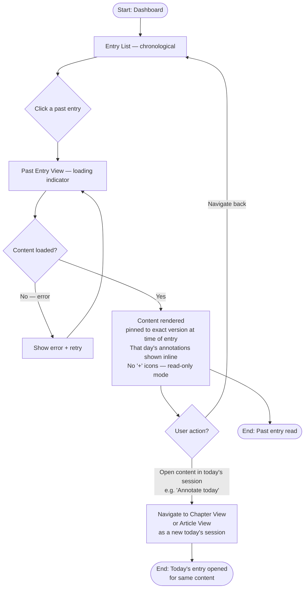

**Key decision points**:
- Past Entry View is read-only: no "+" icons, no annotation editors
- Content is pinned to the specific `contentRef` (including article version) stored in the entry
- "Annotate today" is an optional shortcut — not required for MVP but worth noting

**Screens involved**: Dashboard, Past Entry View

---

## Flow 5: Calendar View → Day's Entries

**Actor**: Reader
**Goal**: See what was studied on a specific past day
**Precondition**: Authenticated; calendar view visible on dashboard with at least one marked day

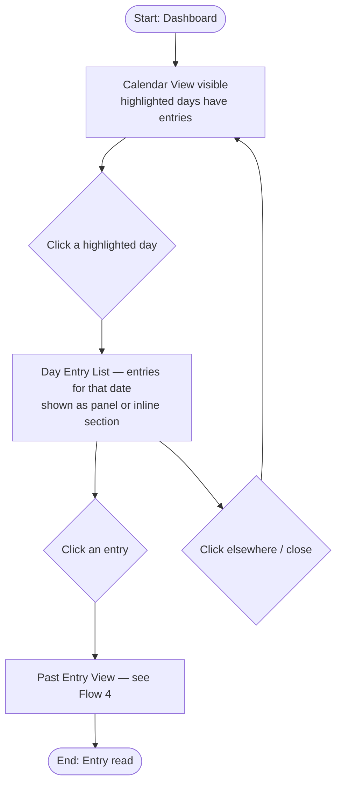

**Key decision points**:
- Only highlighted days (days with entries) are clickable
- Days with no entries show no interaction
- Panel vs. page navigation: TBD in wireframe — both are acceptable

**Screens involved**: Dashboard (Calendar View section), Past Entry View

---

## Flow 6: Change Password

**Actor**: Reader
**Goal**: Update their own password
**Precondition**: Authenticated

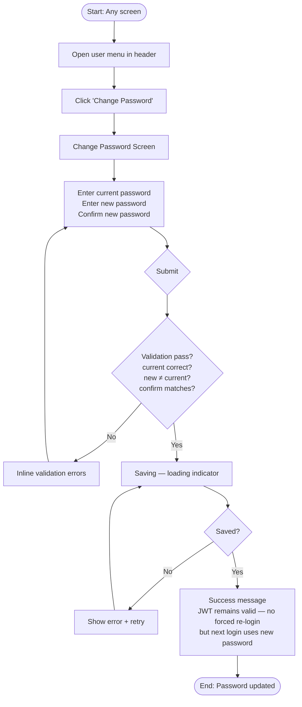

**Key decision points**:
- Current password must be re-verified server-side (prevents session hijacking changing password)
- JWT is not invalidated on password change (acceptable for Phase 1; can be tightened later)
- All validation errors shown inline before server round-trip where possible

**Screens involved**: Change Password Screen (accessed via header user menu)

---

## Flow 7: Login Failure / Expired Token

**Actor**: Reader
**Goal**: Recover from authentication failure and reach desired destination
**Precondition**: Credentials invalid or JWT expired

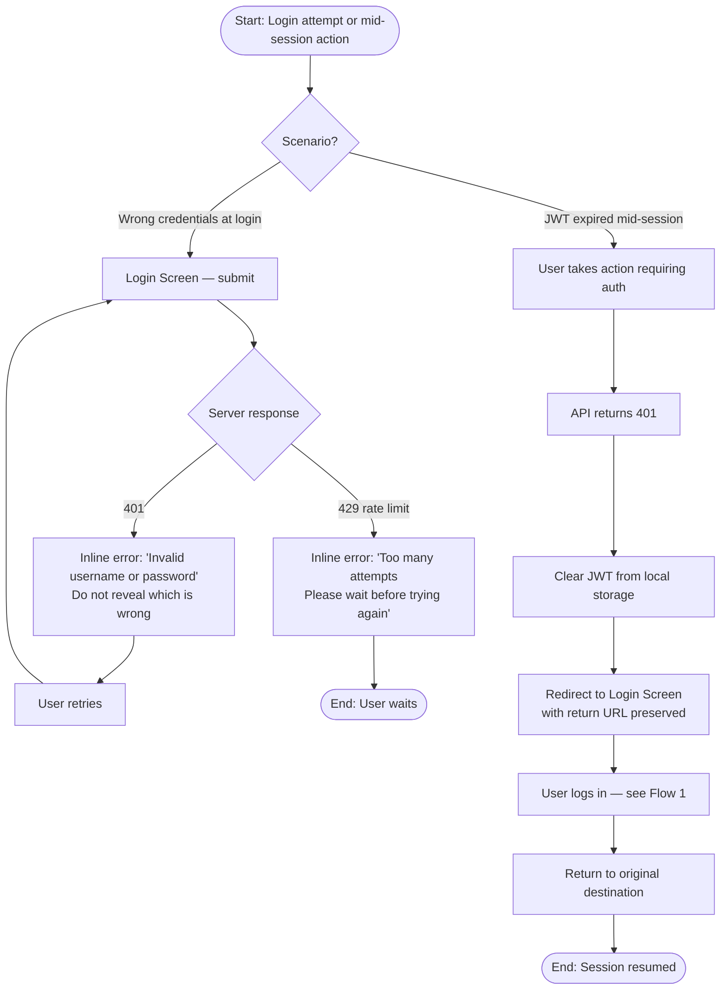

**Key decision points**:
- Never distinguish "wrong username" from "wrong password" in error messages (security)
- Rate limiting (429) shown as a distinct error with wait instruction
- Mid-session expiry: silently redirect to login, return to original page after

**Screens involved**: Login Screen

---

## Flow 8: Article Import — URL Fetch Failure → Manual Paste

**Actor**: Reader
**Goal**: Import article content despite URL fetch failure
**Precondition**: Authenticated; URL fetch has failed

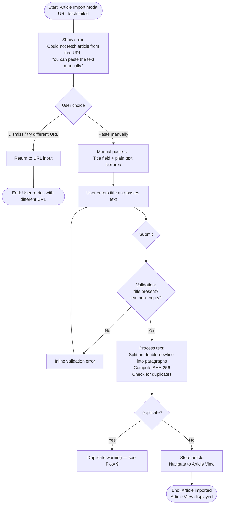

**Key decision points**:
- Manual paste uses double-newline paragraph splitting (fallback since no HTML structure)
- Duplicate detection still runs on manually pasted text via SHA-256
- Source URL is stored as the attempted URL (for reference) even on manual paste

**Screens involved**: Article Import Modal (with manual-paste sub-state)

---

## Flow 9: Article Import — Duplicate Detected

**Actor**: Reader
**Goal**: Avoid storing duplicate content while letting the user continue
**Precondition**: Authenticated; submitted URL or text matches existing article's SHA-256

```mermaid
flowchart TD
    A([Start: Import submitted\nhash matches existing article]) --> B[Show warning:\n'This article was already imported on {date}.\nUse existing copy or re-import?']
    B --> C{User choice}
    C -->|Use existing| D[Navigate to Article View\nusing existing articleId]
    D --> E([End: Article View displayed\nno new storage])
    C -->|Re-import| F[Re-run import\nsame content → same SHA-256 → same articleId\nupdate importedAt timestamp? No — immutable]
    F --> G[Navigate to Article View\nsame articleId]
    G --> H([End: Article View displayed\nno duplicate stored — content-addressed])
```

**Key decision points**:
- Content-addressing means "re-import" of identical text does nothing new — same file, no duplicate
- The warning is informational; both paths lead to the same Article View
- "Re-import" option exists for UX comfort but has no storage effect for identical content

**Screens involved**: Article Import Modal (duplicate warning state), Article View

---

## Flow 10: Article Import — New Version Detected

**Actor**: Reader
**Goal**: Import updated article content while preserving the link to prior version
**Precondition**: Authenticated; URL was previously imported; fetched content has a different SHA-256

```mermaid
flowchart TD
    A([Start: Import submitted\nURL known but hash differs]) --> B[Show notice:\n'This article has changed since it was last imported on {date}.\nA new version will be created linked to the previous.']
    B --> C{User confirms}
    C -->|Cancel| D[Return to URL input]
    D --> E([End: No import])
    C -->|Create new version| F[Store new article with new articleId\nSet previousVersionId to prior articleId\nUpdate URL version index]
    F --> G[Show version badge on Article View:\n'Version 2 — imported {today}. Previous version: {date}']
    G --> H[Article View with new version content]
    H --> I([End: New version imported\nArticle View displayed])
```

**Key decision points**:
- User must confirm before creating a new version — not automatic
- Version badge/indicator is always visible on the Article View when a prior version exists
- Journal entries made against the old version continue to reference the old `articleId`

**Screens involved**: Article Import Modal (new-version state), Article View

---

## Flow 11: Annotation Save Failure → Retry

**Actor**: Reader
**Goal**: Recover from a failed note save without losing draft text
**Precondition**: User has typed a note and attempted to save; server returned an error

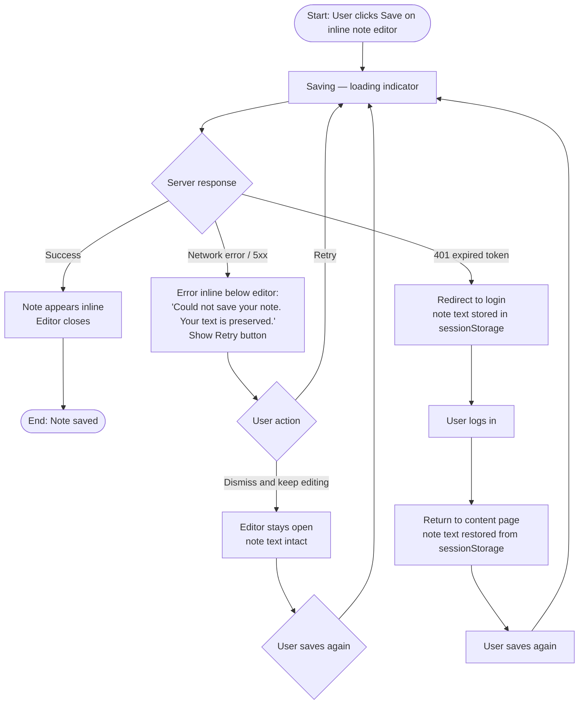

**Key decision points**:
- Draft note text must never be lost regardless of failure mode
- 401 during save: redirect to login, restore note text from sessionStorage on return
- No automatic retry — user explicitly triggers retry

**Screens involved**: Chapter View / Article View (inline editor error state), Login Screen

---

## Flow 12: First-Time User — Empty Dashboard

**Actor**: Reader
**Goal**: Orient a new user with no journal entries and guide them to their first study session
**Precondition**: Authenticated; `users/<userId>/index.json` has zero entries

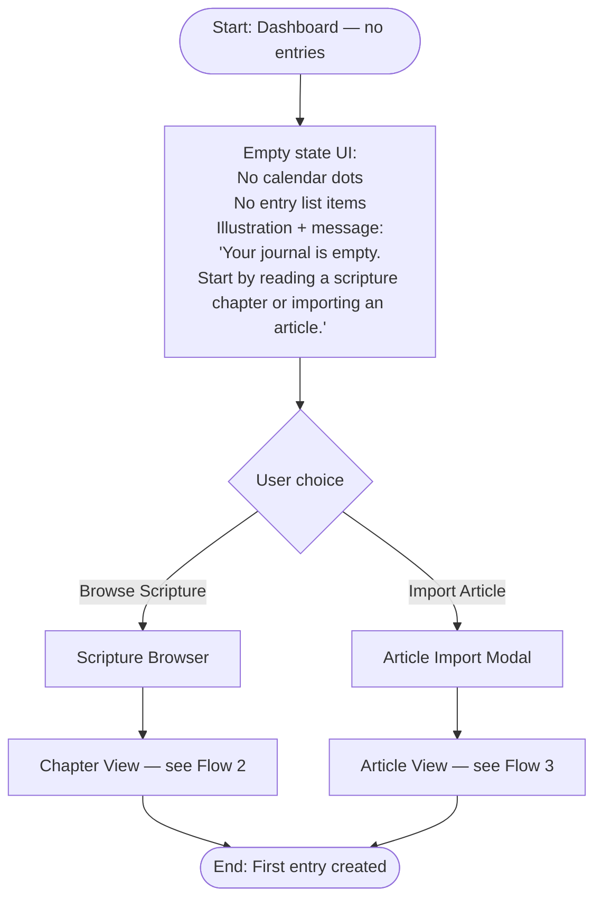

**Key decision points**:
- Calendar renders but shows no highlighted days
- Entry list renders with an empty state message and two CTAs
- After first save, the empty state disappears naturally (no special transition needed)

**Screens involved**: Dashboard (empty state), Scripture Browser, Article Import Modal

---

## Flow 13: Admin Creates New User Account

**Actor**: Admin (Peter initially)
**Goal**: Provision a new user account so someone else can log in
**Precondition**: Admin has access to the admin endpoint or CLI; they know the desired username and initial password

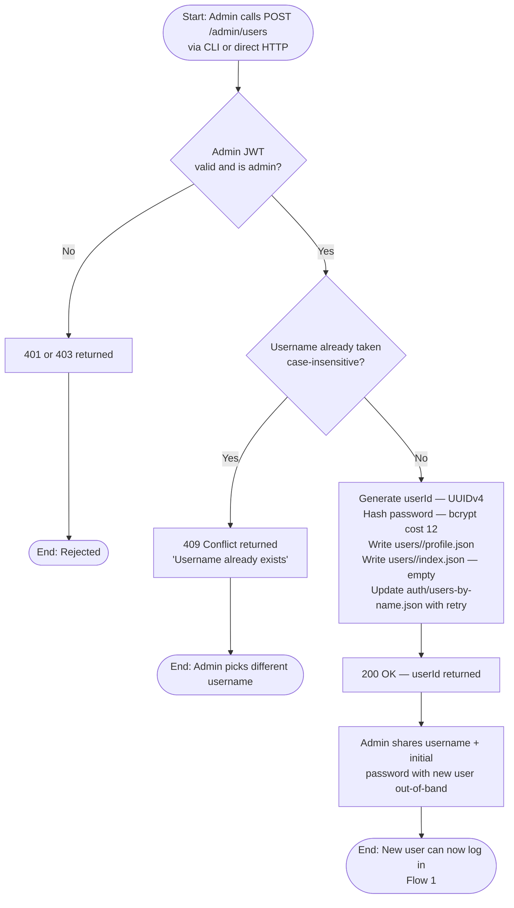

**Key decision points**:
- Admin endpoint is not exposed in the SPA — CLI or direct HTTP only
- `users-by-name.json` uses read-modify-write with 412 retry (shared file)
- Admin does NOT receive the password hash — initial password is known only at creation time; new user should change it (Flow 6) on first login

**Screens involved**: No UI screen — admin CLI/endpoint only

---

## Screen Inventory

| Screen | Description | Flows | Auth required |
|--------|-------------|-------|---------------|
| Login Screen | Username + password form; inline error state; rate-limit state | 1, 7 | No |
| Dashboard | Entry list (chronological) + calendar view; empty state; header with user menu | 1, 4, 5, 12 | Yes |
| Scripture Browser | Three-level hierarchy: Work → Book → Chapter | 2 | Yes |
| Chapter View | Ordered verse list; hover "+" icon; inline note editor; today's annotations inline; prev/next chapter nav | 2, 11 | Yes |
| Article Import Modal | URL input; loading state; duplicate warning state; new-version notice state; manual-paste fallback state | 3, 8, 9, 10 | Yes |
| Article View | Paragraph list; hover "+" icon; inline note editor; today's annotations inline; version badge if versioned | 3, 9, 10, 11 | Yes |
| Past Entry View | Read-only content view (chapter or article) with that day's annotations; no "+" icons; pinned to specific content version | 4, 5 | Yes |
| Change Password Screen | Current password + new password + confirm; inline validation; success message | 6 | Yes |

---

## Navigation Structure

**Entry points**:
- All routes require authentication; unauthenticated visits redirect to Login Screen with return URL preserved.
- After login, default destination is Dashboard.

**Primary navigation** (persistent header):
- `[App name / logo]` → Dashboard
- `Browse Scripture` → Scripture Browser
- `Import Article` → Article Import Modal (opens as overlay)
- `[Username]` dropdown → Change Password, Log Out

**Breadcrumb / back navigation**:
- Scripture Browser: Work → Book → Chapter (each level a clickable breadcrumb)
- Chapter View: breadcrumb back to Scripture Browser at correct level; prev/next chapter links
- Article View: back to Dashboard (no hierarchy)
- Past Entry View: back to Dashboard (or back to Day Entry List if entered via calendar)
- Change Password: back to Dashboard

**Deep-link routes** (React Router):
```
/                        → Dashboard (redirect if unauthed → /login?return=/)
/login                   → Login Screen
/scripture               → Scripture Browser (Work selection)
/scripture/:work         → Scripture Browser (Book selection)
/scripture/:work/:book   → Scripture Browser (Chapter selection)
/scripture/:work/:book/:chapter  → Chapter View
/articles/:articleId     → Article View
/entries/:entryId        → Past Entry View
/settings/password       → Change Password Screen
```

**Exit points**:
- Log out → Login Screen (JWT cleared)
- Session expiry mid-action → Login Screen (return URL preserved)
